# Legal Document RAG Chatbot

This project is an **AI-powered chatbot** that answers user queries based on a provided legal document (e.g., Terms & Conditions, Privacy Policies, Contracts) using a **Retrieval-Augmented Generation (RAG)** pipeline. It supports **real-time streaming responses** in a Streamlit interface and shows the source chunks used to generate answers.

## **Project Architecture & Flow**

1. **Document Loading & Preprocessing**  
   - PDF documents are loaded using LangChain’s `PyPDFLoader`.  
   - Text is cleaned and split into `chunk_size =300` and `chunk_overlap = 50` using `RecursiveCharacterTextSplitter`.  
   - Each chunk is stored with metadata (page number, source) for citation.

2. **Embedding & Vector Database**  
   - Each chunk is converted into embeddings using `sentence-transformers/all-MiniLM-L6-v2`.  
   - Embeddings are stored in `ChromaDB`, enabling semantic similarity search for retrieval. 

3. **RAG Pipeline**  
   - **Retriever:** Fetches top-k relevant chunks from ChromaDB.  
   - **Context Formation:** Chunks are combined into a single context string.  
   - **Generator:** Context + user query is passed to `Gemini-2.0-Flash` (via LangChain) to generate answers.  
   - **Memory Support:** Conversation history is included for multi-turn queries.  
   - **Streaming:** Responses are streamed token-by-token for a better user experience.

4. **Frontend (Streamlit)**  
   - Chat-style interface with user/bot message. 
   - Sidebar displays `chat history` and a `reset chat` option.  

## **Flow Chart**

## **Folder Structure**
/data
    document.pdf                

/src
    /chunks                     # Preprocessed chunks
    /chroma_db                   # Stored embeddings in ChromaDB
    setup.py            # Load, preprocess, and generate embeddings
    retriever.py                # VectorDB retriever
    rag_pipeline.py             # Rag pipeline with memory + streaming

app.py                          # Streamlit chatbot 
requirements.txt                

## **Setup & Running Instructions**

1. **Install dependencies**
    pip install -r requirements.txt

2. **Add Env Variables**
    Create .env file
    GOOGLE_API_KEY=<your_google_api_key>

3. Run - python setup.py

4. Run -  Streamlit run app.py

Ask questions about the document in the input box.
Responses are streamed token-by-token.
Chat history and reset functionality are available in the sidebar.

**Model & Embedding Choice**

1. **Embedding Model**: `sentence-transformers/all-MiniLM-L6-v2`
    Lightweight, fast, and accurate for semantic search.

2. **LLM**: `Gemini-2.0-Flash`
    Supports streaming output and handles context from retrieved chunks.

3. **Vector DB**: `ChromaDB`
    Efficient storage and semantic search for chunk embeddings.

## **Chatbot Interface**

## **Examples** 

## **Watch Live Video**

[Watch the Demo Video](https://drive.google.com/file/d/1d_ibAMAlkZIj6VdXyY2ypzNynEdhg1jr/view?usp=sharing)